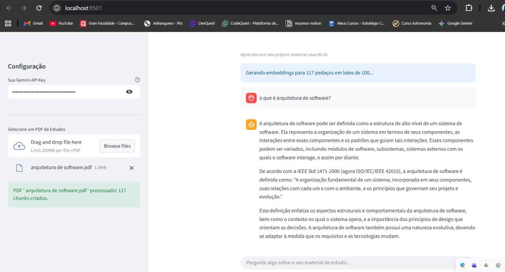

# 🎓 Chatbot de Estudos RAG (PDF + Gemini)

O **Chatbot de Estudos RAG** é uma ferramenta inteligente desenvolvida para ajudar estudantes e profissionais a **interagir com seus próprios materiais de estudo**.  
Com ele, é possível **enviar um PDF** e fazer perguntas sobre o conteúdo — o chatbot responde de forma contextualizada, utilizando **IA generativa (Gemini)** e técnicas modernas de **RAG (Retrieval-Augmented Generation)**.

---

## 🚀 Tecnologias Utilizadas

- 🧠 **Google Gemini API** — geração de respostas e embeddings vetoriais  
- ⚙️ **FAISS (Facebook AI Similarity Search)** — busca vetorial eficiente  
- 🧩 **LangChain Text Splitters** — divisão do conteúdo em blocos de texto (chunks)  
- 📄 **PyPDF** — extração de texto de PDFs  
- 💻 **Streamlit** — interface web interativa e leve  
- 🧮 **NumPy** — manipulação de vetores de embeddings

---

## 🧠 Como Funciona

1. O usuário faz upload de um arquivo **PDF** (por exemplo, uma apostila ou material de estudo).  
2. O app lê e divide o conteúdo em **pedaços menores** (chunks).  
3. Cada pedaço é transformado em **vetores de embeddings** por meio do modelo Gemini.  
4. Quando uma pergunta é feita, o sistema usa o **FAISS** para buscar os trechos mais relevantes.  
5. O modelo **Gemini** gera uma resposta contextualizada com base nesses trechos.

---

## 💡 Exemplo de Fluxo

1. Faça upload de um PDF (`na pasta input tem um pdf que pode ser usado, mas fique a vontade para enviar o seu.`)  
2. Aguarde o processamento dos embeddings  
3. Faça perguntas como (usando o pdf que deixei de exemplo):
   - “O que é um requisito?”  
   - “Me fale o sobre requisito funcional”  
4. Receba respostas geradas pela IA com base **apenas** no conteúdo do seu material ✨
   
---

## 🧰 Instalação e Execução

### 1️⃣ Clone o repositório
```bash
git clone https://github.com/LariPelissari/chatbot-estudos-rag.git
cd chatbot-estudos-rag
```
---
### 2️⃣ Crie um ambiente virtual (opcional)
``` bash
python -m venv venv
source venv/bin/activate  # Linux/Mac
venv\Scripts\activate     # Windows
```
---
### 3️⃣ Instale as dependências
``` bash
pip install -r requirements.txt
```
---
### 4️⃣ Execute o app
``` bash
streamlit run app.py
```
---
### 5️⃣ Configure sua chave da API Gemini

- Acesse Google AI Studio

- Gere uma API Key e insira-a no campo lateral do app
---

## 🖼️ Interface do App
- Abaixo, um exemplo do chatbot processando um PDF e gerando embeddings antes de responder perguntas:
  <p align="center">
  
</p>

---
## 👩‍💻 Autora

**Larissa Pelissari**  
Designer **UX/UI** e **Desenvolvedora de Software**, apaixonada por criar experiências digitais inteligentes e acessíveis.

🌐 [LinkedIn](https://www.linkedin.com/in/laripelissari/)
